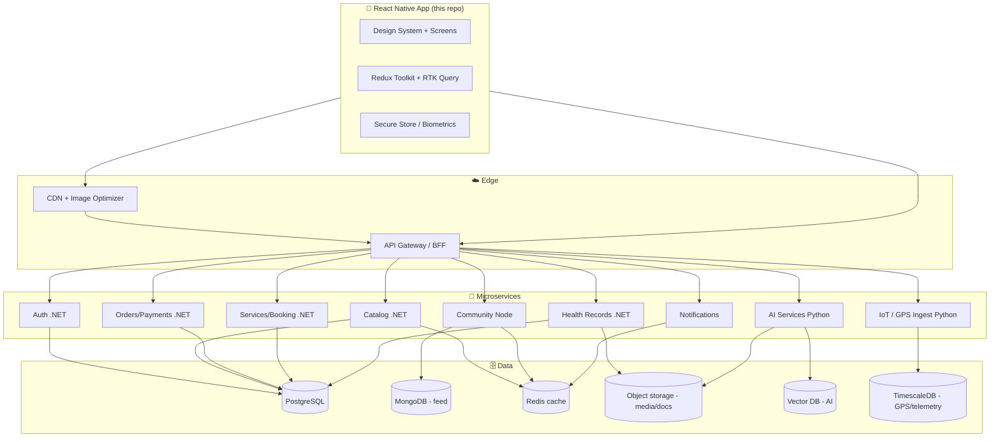
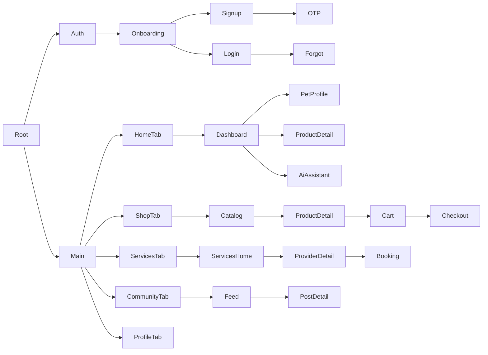

# 🏛️ Pet Commerce Ecosystem — Product & Technical Architecture

> Unicorn-grade blueprint for India's pet super-app. This document is the single
> source of truth for architecture, screens, data, roadmap, deployment and scale.

---

## 1. System architecture (high level)



**Principles:** Clean Architecture, SOLID, feature-sliced mobile, stateless services,
event-driven async (payments, notifications, AI jobs) via a message bus (Kafka/SNS-SQS).

---

## 2. Navigation architecture



- Root switches Auth ⇆ Main on `auth.status`.
- Each tab owns an independent native-stack (deep-linkable, `scheme: petco`).
- Modals: AI Assistant, create-post, SOS sheet (`presentation: 'modal'`).

---

## 3. Screen inventory (MVP shipped + planned)

**Auth:** Onboarding · Login · Signup · OTP · Forgot Password · (Biometric unlock)
**Home:** Dashboard · Pet Profile · Product Detail · AI Assistant
**Shop:** Catalog/Search · Filters · Product Detail · Cart · Checkout · Order Tracking*
**Services:** Services Home · Provider Detail · Slot Booking · Service History*
**Community:** Feed · Post Detail · Create Post* · Groups/Events* · Messaging*
**Health:** Medical Vault* · Health Records · Reminder Engine*
**Adoption:** Listings* · NGO Directory* · Lost & Found*
**Tracking:** Live Map* · Geo-fence* · Travel History*
**Devices:** IoT Dashboard* · Pairing Flow*
**Account:** Profile · Loyalty · Prime · Expense Tracker* · Settings

`*` = designed in roadmap, stubs/architecture ready.

---

## 4. Design system

- **Tokens** (`src/theme/tokens.ts`): palette, gradients, spacing, radius, typography,
  elevation, motion — mirrored in `tailwind.config.js` for className use.
- **Themes** (`src/theme/themes.ts`): full light/dark semantic color maps.
- **ThemeProvider**: system / light / dark, syncs NativeWind color scheme.
- **Primitives** (`src/components/ui`): `AppText`, `Button` (gradient + haptics + spring),
  `Card` (solid/glass/outline, blur), `Input` (RHF-ready, a11y), `Badge`, `Skeleton`/
  shimmer, `FloatingActionButton`, `GradientHeader`, `SectionHeader`, Empty/Error/Offline.
- **UX patterns:** glassmorphism, Material 3 surfaces, micro-interactions, skeletons,
  pull-to-refresh, haptics, animated health ring, bottom-sheet-ready.

---

## 5. State management & API

```
store/
  auth   → user, tokens, biometric, session lifecycle
  cart   → items, coupons, memoized totals (createSelector)
  ui     → active pet, offline flag, bottom-sheet routing
  api    → RTK Query (single baseApi, injectEndpoints per domain)
```

- **`baseApi`** adds bearer token from SecureStore, `401 → refresh → replay`, tag-based
  cache invalidation (`User/Pet/Product/Cart/Order/Service/Booking/Post/Reminder/Device`).
- **Forms:** React Hook Form + Zod (`authSchemas.ts` pattern applies to all forms).
- **Offline:** `ui.isOffline` + RTK Query cache + `OfflineState` component; cart persists.

---

## 6. Database schema (suggested, PostgreSQL core)

```sql
users(id, name, email, phone, password_hash, is_prime, loyalty_points, created_at)
user_roles(user_id, role)                         -- pet_parent, vet, groomer, ...
pets(id, owner_id, name, species, breed, dob, gender, weight_kg, health_score)
pet_allergies(pet_id, label)  pet_conditions(pet_id, label)
vaccinations(id, pet_id, name, administered_at, due_at, status)
documents(id, pet_id, type, url, ocr_text, uploaded_at)        -- medical vault (S3)
products(id, title, brand, category, price, mrp, rating, is_subscribable)
carts(id, user_id)  cart_items(cart_id, product_id, qty, subscription_interval)
orders(id, user_id, status, total, address_id, created_at)  order_items(...)
subscriptions(id, user_id, product_id, interval_days, next_run, status)
service_providers(id, user_id, type, rating, price, verified)
bookings(id, provider_id, pet_id, user_id, slot, status, amount)
posts(id, author_id, content, media_url, created_at)  -- (MongoDB for feed scale)
comments(...)  likes(post_id, user_id)  follows(follower_id, followee_id)
adoptions(id, ngo_id, pet_info, status)  lost_found(id, pet_id, geo, status)
devices(id, user_id, pet_id, type, serial, paired_at)
gps_pings(device_id, lat, lng, ts)                 -- TimescaleDB hypertable
reminders(id, pet_id, type, title, due_at, completed)
transactions(id, user_id, amount, type, gateway_ref)  -- expense tracker/payments
```

Media & documents → object storage (S3/GCS) with signed URLs. AI embeddings → vector DB.

---

## 7. Key user journeys

1. **Onboard → shop → subscribe:** Onboarding → Signup/OTP → Dashboard → Catalog →
   Product → Subscribe & save → Checkout (Prime free delivery) → Order tracking.
2. **Sick pet → teleconsult:** Dashboard SOS/AI → Symptom checker → risk triage →
   Provider → Slot booking → Pay → e-prescription into Medical Vault.
3. **Lost pet:** GPS geo-fence breach push → Live map → mark lost → community alert.
4. **Community:** Feed → like/comment → follow → join group/event.

---

## 8. Feature roadmap

### ✅ MVP (this build)
Auth + profiles, pet management, dashboard, commerce (catalog→checkout), services booking,
community feed, AI assistant chat, dark/light, design system, offline/empty/error states.

### 🔸 Phase 2
- Payments (Razorpay/Stripe) + wallet, order tracking, subscription management.
- Medical Vault + OCR, Reminder Engine (push/SMS/email), health analytics.
- Real-time GPS map + geo-fencing, IoT device pairing dashboard.
- Community: reels, stories, groups, events, DMs, notifications center.
- AI: symptom checker, nutrition planner, breed-match advisor (Python services).

### 🔶 Phase 3
- Adoption & rescue network, NGO/foster, lost & found with verification.
- Pet Prime tiers + insurance partners, loyalty/reward store, referral engine.
- Multi-role dashboards (vet/groomer/boarding), vendor onboarding.
- Web **Admin Portal** (shared types + API), advanced analytics, CMS, ad/sponsored listings.
- Voice AI, AR try-on for apparel, predictive health.

---

## 9. Security

- JWT access + refresh (rotation), OAuth (Google/Apple), RBAC via `user_roles`.
- Tokens in `expo-secure-store` (Keychain/Keystore); biometric unlock (`expo-local-authentication`).
- TLS everywhere, field-level encryption for medical data, signed URLs for documents.
- Input validation (Zod on client, schema validation on services), OWASP Top 10 review,
  rate limiting + WAF at gateway, audit logs.

---

## 10. Production deployment & scalability

- **Mobile CI/CD:** EAS Build + EAS Submit, OTA updates via `expo-updates`, Sentry crash
  reporting, feature flags, phased store rollout.
- **Backend:** containerized microservices on Kubernetes (EKS/GKE), API gateway + BFF,
  autoscaling (HPA), Redis cache, read replicas, CDN for media.
- **Async/scale:** Kafka/SNS-SQS for payments, notifications, AI + GPS ingestion;
  TimescaleDB for telemetry; vector DB for AI retrieval; blue-green/canary deploys.
- **Observability:** OpenTelemetry traces, Prometheus/Grafana, centralized logging.
- **Revenue hooks ready:** marketplace margins, service/vet/boarding commissions,
  insurance referrals, Prime subscriptions, premium AI, device sales, sponsored listings.

---

## 11. Extending the scaffold

| Task | Where |
|------|-------|
| Add a screen | `src/features/<domain>/`, register in matching stack |
| Add API endpoint | `injectEndpoints` on `baseApi` (new file in `services/api/`) |
| Add global state | new slice in `features/<domain>/`, register in `store.ts` |
| New UI primitive | `src/components/ui/`, export from `index.ts` |
| Theme/brand change | `theme/tokens.ts` + `tailwind.config.js` |
| Go live (drop mocks) | replace fixtures in endpoint `query` fns; delete `services/mock` |
