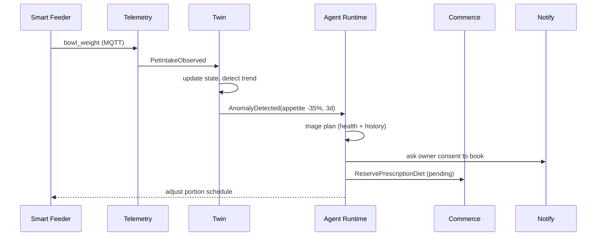
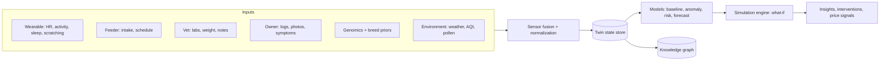
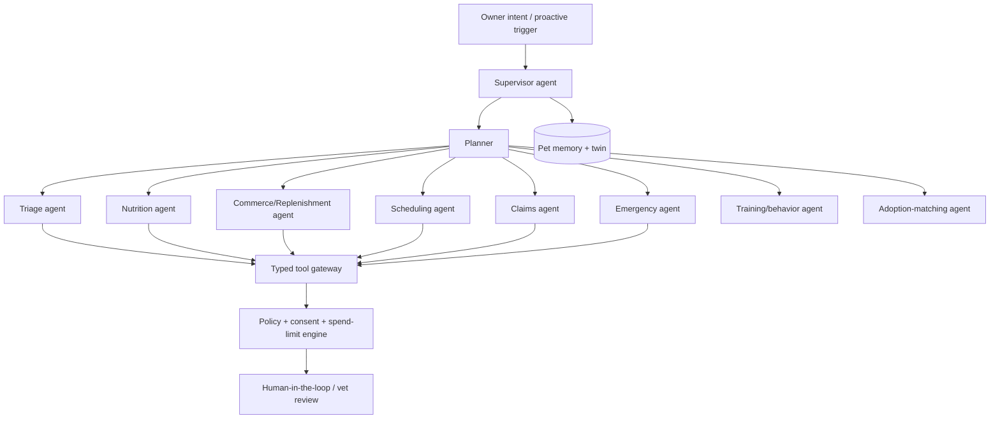
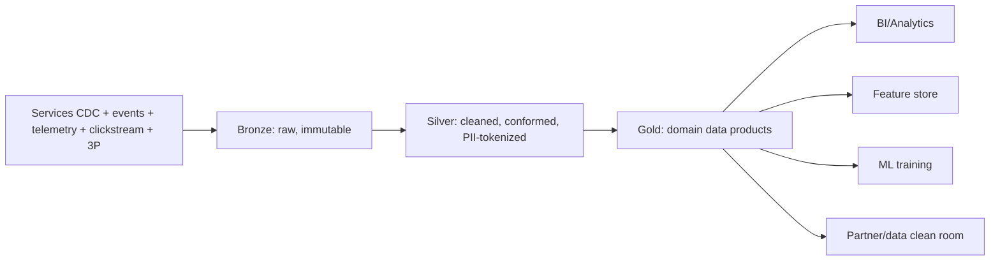
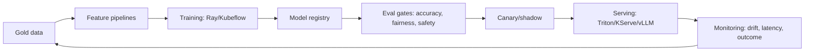
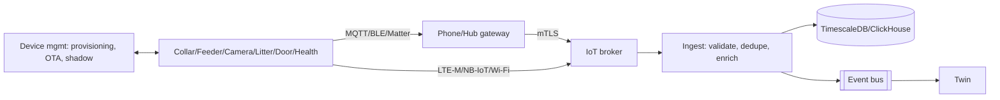
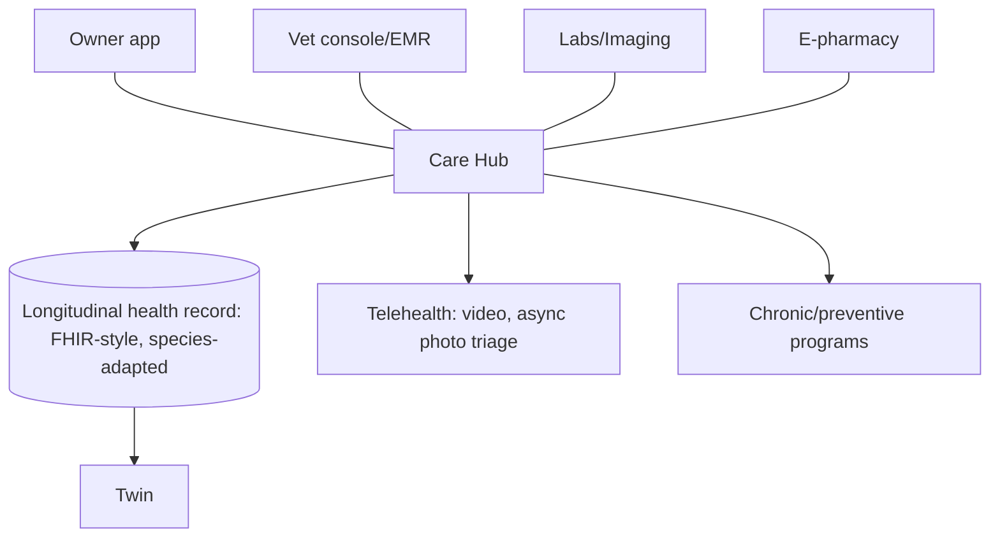
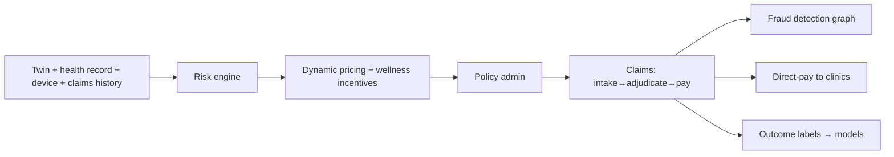
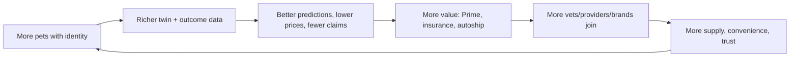

# Pet OS: Platform Architecture & Category-Defining Strategy

Companion to [PET_OS_STRATEGY.md](PET_OS_STRATEGY.md) (business review) and [ARCHITECTURE.md](ARCHITECTURE.md) (current mobile build).
This document redefines the product as an **operating system for a pet's entire life**, from birth to end-of-life care.

## 0. Core thesis and the five-year moat

The mobile app is one *surface*. The product is a **system of record + system of intelligence + system of action** for a pet.

| Layer | Meaning | Why it is hard to copy |
|---|---|---|
| System of record | Pet Identity Graph: portable, verified, lifelong ID | Requires vets, shelters, breeders, insurers and governments to write to it. Network-gated. |
| System of intelligence | Digital Twin + outcome-labeled data | Needs longitudinal care, commerce, device and claims data in one closed loop. |
| System of action | Agent workforce that books, orders, files, dispatches | Needs licensed supply, payments rails, insurance rails and trust. |

**Moats competitors cannot replicate in 5 years (ranked):**
1. **Closed-loop outcome data**: symptom → diagnosis → treatment → cost → recovery → claim. Only a platform that owns care, commerce, devices *and* insurance sees the whole loop. Single-vertical rivals see fragments.
2. **Pet Passport as an interoperability standard**: once vets, boarding, airlines, landlords and shelters *require* it, it is infrastructure (the "SSL certificate of pets").
3. **Vet SaaS as system of record**: clinics' daily workflow lives here; switching cost is operational, not emotional.
4. **Licensed, regulated rails**: insurance MGA/underwriting, e-pharmacy, payments wallet. Multi-year licensing lead time per country.
5. **Hardware-plus-data lock-in**: devices that improve with the twin's history (non-portable personalization).
6. **Local density**: hyperlocal supply per neighborhood (providers, dark stores) is not software-copyable.

> Challenge to prior assumptions: **Commerce is the wedge, not the business.** Gross-margin-weighted, the end state is insurance + SaaS + retail media + fintech + AI. Consumer commerce funds acquisition and generates the data.

---

## 1. Pet OS capability map

```mermaid
graph TB
  subgraph L5["Experience layer"]
    MOB[Mobile/Web/Wear] VOICE[Voice/Smart home] VETUI[Vet console] BRAND[Brand console] API[Public API/SDK]
  end
  subgraph L4["Agentic layer"]
    CO[Care Copilot] ORCH[Multi-agent orchestrator] AG[Specialist agents]
  end
  subgraph L3["Intelligence layer"]
    TWIN[Digital Pet Twin] KG[Knowledge Graph] PRED[Predictive models] REC[Personalization]
  end
  subgraph L2["Domain platforms"]
    HC[Healthcare] CM[Commerce] SV[Services] FIN[Fintech] INS[Insurance] DEV[IoT] COM[Community+Creator] ADP[Adoption] EMG[Emergency] SUBS[Subscriptions]
  end
  subgraph L1["Foundation"]
    PIG[Pet Identity Graph] EB[Event backbone] LAKE[Lakehouse] ID[Identity/Consent] LEDGER[Ledger] TRUST[Trust/Safety]
  end
  L5 --> L4 --> L3 --> L2 --> L1
```

| # | Capability | Primary outcome | Revenue model |
|---|---|---|---|
| 1 | Pet Identity Graph | Lifelong verified identity (microchip/DNA/biometric/QR) | Verification fees, API |
| 2 | Digital Pet Twin | Predict, simulate, prevent | Premium tier, B2B licensing |
| 3 | Agentic workforce | Tasks done, not suggested | Per-action + Prime |
| 4 | Predictive healthcare | Earlier detection, lower claims | Care plans, insurance margin |
| 5 | Predictive commerce | Zero stock-outs, autoship | Subs, margin |
| 6 | Autonomous care automation | Closed-loop device→order→dose | Subs, device data plans |
| 7 | Device ecosystem | Telemetry feeds twin | Hardware + data subscription |
| 8 | Pet financial platform | Wallet, BNPL, savings, vet financing | Take rate, float, interest |
| 9 | Insurance intelligence | Better underwriting, instant claims | Premium margin, MGA fees |
| 10 | Vet SaaS | Own supply, system of record | Seats + payments take rate |
| 11 | Creator economy | Supply of content/trust | Take rate, ads |
| 12 | Hyperlocal services | Dispatch within minutes | Commission |
| 13 | Global pet data platform | Anonymized insights/benchmarks | Data licensing |

---

## 2. Domain-driven design boundaries

Bounded contexts, each owning its data and publishing domain events. No shared databases.

```mermaid
graph LR
  subgraph Core
    IDN[Identity & Consent]
    PET[Pet Identity Graph]
  end
  subgraph Supporting
    HEA[Health Records] CLN[Clinical/EMR] PHM[Pharmacy]
    CAT[Catalog] PRC[Pricing/Promo] ORD[Orders] FUL[Fulfillment/Delivery] SUB[Subscriptions]
    BKG[Booking/Dispatch] PRV[Provider Mgmt]
    PAY[Payments/Wallet] LED[Ledger] LND[Lending/BNPL]
    POL[Policy] UND[Underwriting] CLM[Claims]
    DEV[Device Mgmt] TEL[Telemetry]
    SOC[Social Graph] CNT[Content] CRE[Creator Payouts]
    ADO[Adoption] EMG[Emergency] NTF[Notifications]
  end
  subgraph Intelligence
    TWN[Twin] KGS[Knowledge Graph] FST[Feature Store] AGT[Agent Runtime] GOV[AI Governance]
  end
```

**Context map rules**
- **Pet** is an *anchor aggregate*: other contexts reference `petId` only, never duplicate pet state (they keep projections).
- **Anti-corruption layers** at every external boundary (vet PMS imports, insurers, payment gateways, device vendors).
- **Consent is a first-class context.** Every cross-context read of health data checks purpose-bound consent (insurer, vet, brand each distinct).
- **Ledger is the only source of truth for money.** Double-entry, immutable, all contexts post via commands.

---

## 3. Event-driven microservices blueprint

**Backbone:** Kafka (or Redpanda/Pulsar) with schema registry (Avro/Protobuf), outbox pattern per service, CDC (Debezium) into the lakehouse.



**Canonical event taxonomy** (versioned, `domain.entity.verb.v1`): `pet.identity.verified`, `health.vaccination.due`, `device.telemetry.received`, `twin.anomaly.detected`, `order.placed`, `subscription.renewal.predicted`, `claim.submitted`, `policy.risk.rescored`, `booking.dispatch.matched`, `emergency.sos.raised`.

**Patterns**
- **Sagas (orchestrated)** for order→payment→fulfillment, claim→adjudicate→payout, booking→escrow→release.
- **CQRS + materialized read models** for dashboards; **event sourcing** only for Ledger, Health Records, Claims (auditability).
- **Idempotency keys** on every command; **exactly-once-effect** via outbox + dedupe tables.
- **Cell-based isolation**: each region split into cells (~1-2M users) to cap blast radius.
- **Edge:** GraphQL federation gateway + BFF per client class; persisted queries; gRPC internally.
- **Languages:** .NET for transactional cores (orders, payments, claims), Python for ML/agents, Go/Rust for telemetry ingest, TypeScript for BFF and clients.

---

## 4. Pet Identity Graph

A property graph that is the root of trust.

**Nodes:** Pet, Person, Household, Vet, Clinic, Shelter, Breeder, Device, Policy, Product, Condition, Medication, Location, Document.
**Edges (typed, time-bounded, consented):** `OWNS`, `FOSTERS`, `TREATED_BY`, `INSURED_BY`, `WEARS`, `SIRED_BY`, `LITTERMATE_OF`, `ADOPTED_FROM`, `TRAVELED_TO`.

**Identity assurance ladder (verification tiers)**
1. Self-declared → 2. Photo nose-print/face biometric embedding → 3. Microchip ID (ISO 11784/5) verified by vet → 4. DNA-linked → 5. Government registry attested.
Higher tiers unlock insurance, travel, adoption and breeding trust.

**Pet Passport:** signed verifiable credentials (W3C VC/DID) for vaccinations, microchip, pedigree, insurance status. Verifiers (airline, boarding, landlord) check a QR without any account. This creates the standard.

**Storage:** graph DB (Neo4j/Neptune/TigerGraph) for traversal + Postgres for authoritative attributes; graph is a projection fed by events.

---

## 5. Digital Pet Twin architecture

The twin is a **continuously calibrated, per-pet state-space model**, not a dashboard.



**Twin state vector (per pet, versioned):** physiological baseline (resting HR, activity profile, sleep architecture), body condition (weight/BCS trajectory), diet & intake, medication adherence, condition risk scores (dental, renal, joint, obesity, dermatologic, cardiac), behavioral profile, genetic risk priors, environmental exposure, life-stage.

**Capabilities**
- **Personal baselines** (not population thresholds): anomaly = deviation from *this* pet's rhythm.
- **Hierarchical Bayesian / state-space models** with breed/age priors that fall back gracefully when data is sparse (cold-start for new pets).
- **Counterfactual simulation:** "If Bruno switches to diet X, projected weight in 12 weeks and joint-stress score?" (monetizable premium feature).
- **Twin cohorts:** federated learning across twins by breed/age to improve priors without exposing individuals.
- **Provenance + confidence on every field**; twin never claims diagnosis, it emits *risk with uncertainty* and routes to a vet.

**Serving:** hot state in Redis/Feast online store; durable state in a versioned store (Postgres + Iceberg snapshots); streaming updates via Flink.

---

## 6. Knowledge Graph + Vector strategy

**Knowledge graph (veterinary + commerce ontology)**
- Entities: breeds, conditions, symptoms, drugs (dosage by species/weight), ingredients, products, procedures, contraindications, guidelines.
- Sources: licensed vet formularies, WSAVA/AAHA/ICAR guidelines, peer literature, internal outcome data (highest value, proprietary).
- Used for: **grounding agents** (every medical claim cites a node), safety rules (toxicity: grapes, xylitol, lilies), contraindication checks on orders, product-to-condition mapping.

**Vector DB strategy** (pgvector → Qdrant/Milvus at scale)
| Index | Content | Use |
|---|---|---|
| Clinical RAG | Guidelines, formulary, vet notes (de-identified) | Grounded Q&A |
| Pet memory | Per-pet episodic memory (conversations, events) | Copilot continuity |
| Catalog | Product text+image embeddings | Semantic search, visual search |
| Case similarity | Anonymized case embeddings | "Pets like yours" |
| Media | Photos (skin, gait, stool, dental) | Visual triage retrieval |

Rules: **per-tenant/per-pet namespaces**, PII-stripped shared indexes, embedding model versioning with dual-index migration, hybrid BM25+vector with reranker, freshness metadata for guideline expiry.

---

## 7. Agentic AI workforce

Agents are **employees with scoped authority**, not a chatbot.



**Design principles**
- **Typed tool gateway:** agents call versioned tools (`book_appointment`, `place_order`, `submit_claim`) with schemas, never raw DB/API. Every call is authorized against *delegated authority*: per-agent, per-user spend caps, action allow-lists, reversibility class.
- **Action classification:** `read` (auto) → `reversible write` (auto with undo window) → `financial/medical` (explicit confirm) → `irreversible` (never autonomous).
- **Medical safety envelope:** triage agent cannot diagnose or prescribe; emits risk class (`emergency / same-day / routine / monitor`) with citations; **any emergency-class output hard-routes to SOS flow** regardless of model confidence.
- **Multi-agent workflow example: "Bruno limping"**
  1. Triage agent gathers structured symptoms + pulls twin (activity drop, weight, age, breed joint risk).
  2. Risk = same-day. Scheduling agent finds nearest in-network vet with slot, checks insurance coverage.
  3. Claims agent pre-authorizes; Commerce agent holds joint supplement; Notification agent asks one-tap confirm.
  4. Post-visit: vet notes ingested → twin updated → follow-up plan, medication reminders, reorder agent schedules refill.
- **Proactive mode:** triggers from events (twin anomaly, low stock, vaccine due) rather than user prompts. This is the retention engine.
- **Evaluation:** offline eval suites per agent (golden tasks, adversarial toxicology cases), shadow mode before autonomy, per-action precision/recall, regret metrics (undo rate), vet-reviewed sampling.
- **Runtime:** durable workflow engine (Temporal) for long-running agent tasks; LLM gateway with routing (small model for routing/extraction, large for reasoning), caching, redaction, fallbacks, per-tenant budgets.

---

## 8. Data platform: Lakehouse



- **Format:** Apache Iceberg on object storage; Spark/Flink; dbt for transforms; Trino for ad hoc; streaming via Flink into Iceberg with exactly-once.
- **Data mesh with contracts:** each domain publishes versioned data products with SLAs and schema contracts; central platform provides tooling, catalog (DataHub), lineage (OpenLineage), quality (Great Expectations/Soda).
- **Privacy architecture:** tokenization vault for direct identifiers, column-level encryption, purpose-based access (ABAC), row-level policy by consent flags, differential privacy for published aggregates, **clean rooms** for brand/insurer analytics.
- **Regional data planes:** raw PII never leaves its residency region; only privacy-safe aggregates and model weights federate globally.

## 9. Feature store

- **Offline:** Iceberg-backed (Feast/Tecton-style); point-in-time-correct joins to prevent leakage.
- **Online:** Redis/DynamoDB, p99 < 10 ms; streaming features (Flink) for recent-window signals (e.g. last-24h activity delta).
- **Entities:** pet, person, household, product, provider, device, policy.
- **Feature groups:** twin physiology, purchase cadence, engagement, price sensitivity, care adherence, claims risk, provider quality.
- **Governance:** owner, SLA, drift monitor, lineage, consent tags; features derived from health data carry `purpose` tags so a brand model *cannot* consume them.

## 10. MLOps



- Model classes: forecasting (replenishment, demand), ranking/recs, anomaly (twin), risk (health/claims/fraud), CV (skin/dental/gait/weight-from-photo), LLM/agents, pricing, ETA/dispatch.
- Gates: **no promotion without** offline metrics, subgroup fairness (breed/region/price tier), safety eval, shadow traffic, rollback plan.
- **Closed feedback loop:** vet-confirmed outcomes become labels (the proprietary advantage); active learning selects cases for vet annotation.
- **Cost:** distillation to small models for high-volume paths, quantization, batch vs. real-time split, spot training, semantic caching.

---

## 11. IoT architecture



- **Provisioning:** per-device X.509 identity (secure element), zero-touch pairing via QR + BLE, ownership transfer flow (resale/adoption), remote revoke.
- **OTA:** signed, staged rollouts, automatic rollback, delta updates.
- **Edge intelligence:** on-device anomaly gating (TinyML) to save power/bandwidth; cloud for fusion.
- **Open ecosystem:** SDK + certification program for 3P devices (feeders, cameras, litter robots); Matter/Thread, HomeKit, Alexa/Google Home, Home Assistant adapters. **Platform strategy: be the pet data layer, not just a hardware vendor.**
- **Robotics:** actuation contract (`dispense`, `open_door`, `clean_cycle`) exposed as agent tools with safety interlocks (weight limits, schedule locks, vet override).
- **Wearables roadmap:** v1 GPS+activity collar, v2 HR/respiration/temp, v3 saliva/skin biosensing, plus smart-collar-as-identity (secure NFC tag for Passport).
- **Data subscriptions:** hardware at/below cost; recurring plan unlocks twin insights, vet escalation and insurance discounts.

---

## 12. Healthcare platform



- **Longitudinal record** using a FHIR-inspired species-adapted model (SNOMED-Vet/VeNom coding) with import adapters for existing PMS (IDEXX, Covetrus, Shepherd, Provet).
- **Care programs (recurring):** puppy/kitten first-year, dental, weight, senior, diabetes, kidney, arthritis, behavioral. Each = protocol + devices + meds + check-ins + outcome measurement.
- **Telehealth:** synchronous video, async photo/video triage with AI pre-read, VCPR (vet-client-patient relationship) compliance by jurisdiction.
- **E-pharmacy:** prescription verification, interaction/dose-by-weight checks from KG, cold chain, auto-refill tied to adherence data.
- **Outcome measurement:** standardized outcome scores → fuel for insurance pricing and provider quality ranking.
- **Safety:** every AI output logged with sources, clinician override, adverse-event reporting pipeline.

## 13. Veterinary SaaS (the supply-side wedge)

- **Product:** EMR/PMS, scheduling, client comms, inventory, imaging viewer, telehealth, payments (embedded), reminders, marketing, analytics.
- **Why vets adopt:** free or low-cost core + *revenue uplift* (online bookings, Rx fulfillment margin share, payment financing for clients, automated recalls, reduced no-shows).
- **Multi-tenant architecture:** tenant-per-row with RLS by default, dedicated-cell option for hospital groups; configurable workflows (small animal, equine, exotic, mobile vet); offline-capable desktop/tablet client with sync (CRDT/op-log).
- **Network effect:** each clinic brings its client base into Pet OS; records flow with consent across clinics (continuity of care), a superpower no standalone PMS has.
- **Platform economics:** SaaS seats + payments take rate + pharmacy margin share + lead-gen + financing fees.
- **Enterprise:** vet group/DSO consolidation dashboards, benchmarking, procurement marketplace.

---

## 14. Insurance intelligence network



- **Model:** become an MGA/agent first (carrier-backed), then captive/reinsured as data proves loss ratio advantage.
- **Underwriting edge:** continuous risk scoring from twin (not static breed/age tables); wellness-linked pricing (adherence, activity, preventive care reduce premium); explicit fairness and regulatory guardrails (no use of prohibited attributes; explainable factors; regulatory filings per jurisdiction).
- **Claims automation:** photo/PDF invoice OCR → coverage match → auto-adjudicate low-risk claims in seconds; **direct-to-vet payment** at the clinic via Vet SaaS (eliminates reimbursement friction, biggest pain point).
- **Fraud:** graph analytics across pets, providers, devices, addresses (duplicate chip, inflated invoices, provider rings).
- **Flywheel:** more insured pets → more claims outcomes → better risk models → lower loss ratio → lower price → more insured pets. Preventive care reduces claims, so platform engagement *is* underwriting profit.
- **Embedded distribution:** every checkout, adoption, vet visit and Prime signup is a point-of-need quote.

## 15. Fintech architecture

- **Components:** wallet, stored value, UPI/cards/net banking/bank transfer, **Ledger** (double-entry, event-sourced), split payments & escrow (marketplace), payouts, BNPL / vet-bill financing, savings goals ("pet emergency fund"), insurance premium financing, reconciliation, tax/GST invoicing, FX.
- **Compliance:** PCI-DSS scope minimization (tokenized gateways), KYC/AML for providers/creators, RBI PA/PPI regulatory path (India) or licensed-partner model initially, strong customer authentication, fraud scoring (device, velocity, graph).
- **Design:** idempotent payment commands, sagas with compensating actions, daily double-entry reconciliation against PSPs, immutable audit trail, multi-currency ledger from day one.
- **Monetization:** payments take rate, float, financing interest, interchange share on co-branded card, instant provider payout fee.
- **Underwriting credit** uses platform behavioral data (subscription history, vet payment history) enabling approval where bureaus have no file.

## 16. Marketplace architecture

- **Two-sided and three-sided** (owners, providers, brands) with shared trust infrastructure.
- **Matching/dispatch:** geospatial index (H3), supply forecasting, ETA models, batching, surge/incentives, provider fatigue and quality constraints; same engine for walkers, groomers, mobile vets, taxis, couriers.
- **Trust & safety:** KYC, background checks, credential verification (vet license registry), escrow release on completion, insurance-backed guarantee, review authenticity (verified-transaction only), dispute workflow with evidence (GPS trail, photos), ML risk scoring for both sides.
- **Catalog:** unified PIM, 1P/3P/private-label, brand portal, content enrichment via LLM with human QA, safety/toxicity flags from KG.
- **Pricing:** dynamic, personalized offers within guardrails, Prime pricing, bundles ("complete routine").
- **Retail media network:** sponsored listings, sponsored brand pages, in-feed and *twin-targeted* (privacy-safe, consent-gated) campaigns, closed-loop attribution via clean room.
- **Fulfillment:** dark-store mesh (10-30 min), hub-and-spoke next-day, pharmacy cold chain, 3P fulfilment-as-a-service for brands.

## 17. Subscription architecture

- **Subscription engine** (billing, entitlements, proration, pause/skip/swap, dunning with smart retries, tax) decoupled from products; any domain can mint a subscription (food, meds, toys, insurance, Prime, device data, care programs, vet plans).
- **Predictive autoship:** forecast depletion from household size, pet weight, feeder telemetry, past cadence; ship *just before* run-out; adjusts automatically when twin shows weight change.
- **Anti-churn:** skip/pause rather than cancel, pet-loss sensitive flow (compassionate offboarding, memorial), win-back by life-event.
- **Bundles:** "Care Plan" (food + preventive meds + dental + telehealth) priced below sum-of-parts, increases switching cost.

---

## 18. Pet Prime 2.0

From "free delivery club" to the **pet-life membership**.

| Tier | Includes | Economics |
|---|---|---|
| Prime Basic | Free hyperlocal delivery, 2x points, member pricing | Drives frequency |
| Prime Care | + unlimited telehealth, AI copilot full autonomy, annual wellness check credit, Rx savings | Replaces vet-visit anxiety, cuts claims |
| Prime Protect | + insurance bundled/discounted, emergency fund match, SOS dispatch, ambulance credits | Insurance distribution at near-zero CAC |
| Prime Family | Multi-pet household, shared caregivers, co-owner wallet | Lifetime household lock-in |

- **Value proof:** monthly "Prime saved you ₹X" ledger (retention lever).
- **Partner perks:** boarding, airline pet fees, pet-friendly stays; creator-exclusive drops.
- **Dynamic membership:** price/perk personalization by pet risk and engagement, health-linked discounts.
- **Target:** 30-40% of GMV from members, net revenue retention > 120%.

---

## 19. Community and creator economy

- **Graph, not feed:** interest and *pet-similarity* graph ("Golden Retrievers, age 2, in Pune, with allergies") powers discovery, groups, Q&A and local meetups.
- **Creator platform:** storefronts (affiliate + own-brand), shoppable video, paid communities, courses (training), consultations, tipping, brand deal marketplace, analytics, instant payouts through Fintech.
- **Expert layer:** verified vets/trainers answer Q&A (AI-assisted drafts), content tagged to KG, monetized via lead-gen and subscriptions.
- **Trust:** AI + human moderation, medical-misinformation classifier routed to vet review, provenance for sponsored content.
- **Moat:** creators' audience and revenue are locked to Pet OS payouts, KG-based content discovery and shoppable commerce.

## 20. Hyperlocal services network

- Unified dispatch for delivery, walkers, groomers, mobile vets, ambulance, taxi, boarding.
- **Density strategy:** launch hub neighborhood by neighborhood; each micro-market needs supply minimums; use Vet SaaS and creator network to seed supply.
- **Emergency network:** SOS → nearest 24x7 clinic capacity (live availability via SaaS), ambulance dispatch, pre-alert with the pet's record/allergies/insurance; handoff packet auto-generated. This is the trust-defining moment of the brand.
- **Adoption & rescue network:** verified shelters (SaaS-lite CRM), matching via lifestyle + breed-behavior models, post-adoption care plan auto-enrolled (ethical LTV), foster network, lost-and-found with community + device + QR.

---

## 21. Growth, network effects, and flywheels

**Core flywheel**


**Layered network effects:** data (twin accuracy), identity (passport acceptance), supply (vet SaaS), local density (hyperlocal), social (creators + groups), hardware (device interoperability), financial (wallet/liquidity).

**Viral loops (engineered, not hoped for)**
1. **Lost-pet QR/NFC**: finder scans, helps, joins; strongest civic loop.
2. **Passport verification**: boarding/airline/landlord asks for it, so owners must onboard.
3. **Vet invites client**: SaaS flows convert entire clinic books.
4. **Shareable twin cards**: "Bruno's health year in review", milestone reels.
5. **Co-owner/caregiver invites**: family, walkers, sitters get roles, each a new user.
6. **Adoption → lifetime**: shelter onboarding with free starter Prime.
7. **Creator referral**: attribution + revenue share.
8. **Insurance referral**: premium discount for referrer and referee.

**Retention flywheels**
- Utility (reminders, autoship, health timeline) → habit → embedded data → personalization → higher utility.
- Emotional (memories, milestones, memorial) → switching cost no competitor can export.
- Financial (Prime savings ledger, emergency fund, premiums tied to wellness).

**Gamification:** Pet Health Score, streaks that map to *real* health behaviors, community challenges, household shared goals, reward points redeemable on care (not just discounts), verified milestone badges (vaccination complete, dental year). Rule: **never reward behavior that is not good for the pet.**

**Monetization flywheel:** commerce margin funds acquisition → data → better insurance pricing → recurring premium → funds hardware subsidy → telemetry → better twin → retail-media targeting → more margin.

## 22. Pet financial & data platforms (global)

- **Global Pet Data Platform:** anonymized, consented, aggregated benchmarks: breed health indices, regional disease surveillance (early epidemic signal), cost-of-care indices, product efficacy real-world evidence. Customers: pharma, CPG, insurers, researchers, governments, universities.
- **Data products:** Breed Health Index, Outbreak Radar, Real-World Efficacy Reports, Pricing Benchmarks, Shelter Intake Forecasts.
- **Governance:** consent ledger, purpose limitation, k-anonymity floors, DP noise, audit, revenue share/benefit to users (data dividend via Prime credits) as a trust and regulatory advantage.

---

## 23. Global scaling and multi-region deployment

```mermaid
graph TB
  GLB[Global DNS + anycast + CDN]
  subgraph IN[India region plane]
    CIN1[Cell A] CIN2[Cell B] DIN[(Regional data)]
  end
  subgraph EU[EU region plane]
    CEU1[Cell A] DEU[(Regional data)]
  end
  subgraph US[US region plane]
    CUS1[Cell A] DUS[(Regional data)]
  end
  GLB --> IN & EU & US
  IN -. aggregates/model weights only .-> GL[(Global analytics plane)]
  EU -. aggregates/model weights only .-> GL
  US -. aggregates/model weights only .-> GL
```

- **Cell-based architecture** per region; users homed to a cell; blast-radius limited; per-cell capacity ~1-2M MAU; scale by adding cells.
- **Data residency by design:** regional PII planes; global control plane contains no PII (routing, config, feature flags, catalog of public data).
- **Active-active** across availability zones; cross-region DR with RPO < 1 min / RTO < 15 min for tier-0 (payments, emergency).
- **Localization framework:** currency, tax engine, payment methods, languages (RTL), units, drug/pharmacy rules, vet licensing, insurance regulation, content policy, holiday/seasonal calendars; all as **country packs** (configuration + plugins, not forks).
- **Expansion sequencing:** India metros → tier-2 → SEA/MENA (similar economics) → UK/EU (insurance/Rx margin) → US (largest TAM, strongest incumbents; enter via Vet SaaS + insurance, not consumer commerce).
- **Partner-led entry:** acquire/partner with local vet chains, shelters and distributors; identity/passport accreditation per country.

## 24. Zero-trust security architecture

- **Identity everywhere:** workload identity (SPIFFE/SPIRE), mTLS service mesh, short-lived credentials, no network-trust.
- **Authorization:** central policy engine (OPA/Cedar), ABAC using role, consent, purpose, tenant, data class; deny by default.
- **Data protection:** envelope encryption with per-tenant/per-region KMS keys (HSM-backed), field-level encryption for health/financial data, tokenization vault, client-side E2EE option for sensitive vault documents, secrets manager, no secrets in code.
- **Endpoint/app:** device attestation (Play Integrity/App Attest), certificate pinning, jailbreak/root signals, biometric step-up for sensitive actions (claims, payouts, emergency contacts), secure storage.
- **AI-specific security:** prompt-injection defenses (instruction hierarchy, tool-input sanitization, content provenance), tool authorization independent of model output, output filtering, data exfiltration controls, red-team program, model supply-chain integrity (signed artifacts).
- **IoT security:** secure boot, secure element, signed OTA, anomaly detection on device behavior, rapid revocation.
- **Operations:** SIEM + UEBA, immutable audit logs, break-glass with dual control, secure SDLC (SAST/DAST/SCA/IaC scanning, SBOM), bug bounty, tabletop/IR drills, chaos + security game days.

## 25. Compliance architecture

- **Privacy:** DPDP (India), GDPR/UK-GDPR, CCPA/CPRA; consent ledger, purpose binding, DSAR automation (access/erasure/portability), data minimization, retention schedules, DPIAs, regional processors register.
- **Health/vet regulation:** VCPR rules by jurisdiction, pharmacy licensing, telemedicine rules, controlled substances handling, adverse-event reporting.
- **Financial:** PCI-DSS, KYC/AML/CFT, RBI (PA/PPI/digital lending guidelines), SOC 2 Type II, ISO 27001/27701/42001.
- **Insurance:** IRDAI / NAIC / EIOPA filings, rate/form approval, claims handling standards, fair-treatment auditing, solvency/reserve reporting.
- **Compliance-as-code:** policies as OPA rules, continuous controls monitoring, evidence auto-collection, region-specific pipelines that block non-compliant deploys.

## 26. AI governance architecture

- **Model & agent registry** with risk tiering: Tier 1 (informational), Tier 2 (recommendations), Tier 3 (medical/financial/insurance decisions) with escalating controls.
- **Controls:** documented intended use, eval evidence, bias/fairness reports, human oversight definition, incident process, rollback, versioned prompts and policies, decision logging with reason codes.
- **Medical AI**: clinical advisory board sign-off, vet review of safety cases, claims language (decision support, not diagnosis), post-market surveillance.
- **Insurance AI**: explainable pricing/claims, adverse-action explanation, protected-attribute audits, regulator-ready model documentation.
- **Transparency to users:** "why am I seeing this" and "what data was used", consent controls, AI-disclosure labeling, opt-out of personalization without losing core features.
- **Alignment with:** NIST AI RMF, ISO 42001, EU AI Act (high-risk obligations pre-mapped).

## 27. Observability architecture

- **Three pillars + product signal:** OpenTelemetry traces, metrics, logs; business-event observability (order funnel, claim funnel, dispatch ETA accuracy).
- **SLOs per user journey** (not per service): SOS reaches clinic < 5 s, checkout success > 99.9%, claim auto-adjudication p95 < 60 s, twin alert freshness < 2 min.
- **AI observability:** prompt/response traces (redacted), tool-call graphs, groundedness/citation rate, hallucination and refusal rates, cost per task, drift, undo/regret rate, human-override rate.
- **Data observability:** freshness, volume, schema, distribution drift, lineage-based impact analysis.
- **Operations:** error budgets gating releases, automated canary analysis, synthetic journeys per region, chaos engineering, tiered on-call with runbooks, post-incident learning with blameless reviews.

## 28. Cost optimization strategy

- **Unit economics as engineering metric:** cost per order, per active pet, per AI task, per telemetry message, per claim; dashboards per team (FinOps).
- **AI cost:** model routing cascade (small → large on need), prompt/semantic caching, distillation, batch for non-urgent, retrieval before generation, token budgets per agent/user tier, on-device inference for simple tasks.
- **Data:** tiered storage (hot/warm/cold/archive), Iceberg compaction, TTL on raw telemetry (downsample to rollups), columnar compression, avoid duplicate copies via data products.
- **Compute:** Graviton/ARM, spot for stateless/ML training, autoscaling on queue depth, right-sizing automation, regional cost-aware placement, scheduled non-prod shutdown.
- **IoT:** edge filtering and batching, delta encoding, adaptive sampling when stable.
- **Build vs buy:** buy commodity (auth, email/SMS, video, observability at early scale), build moats (identity graph, twin, agents, ledger, risk).
- **Target gross margin path:** 20% (commerce-only) → 40%+ (mix shift to insurance/SaaS/ads/fintech).

---

## 29. Three-year roadmap

**Year 1: Habit + data foundations (earn the right)**
- Pet Identity v1 (profile + vet-verified microchip + QR tag), Pet Passport (vaccines).
- Event backbone, lakehouse v1, feature store v1, consent ledger, LLM gateway.
- Predictive autoship, subscriptions engine, wallet + ledger, e-pharmacy (1-2 cities).
- Vet SaaS MVP (scheduling, EMR-lite, payments, recalls) with 300-500 clinics.
- Care Copilot v1 (grounded RAG, triage with SOS routing, read + reversible actions).
- GPS collar + feeder integrations; telemetry pipeline; twin v0 (baselines + anomaly).
- Hyperlocal dispatch v1 (delivery + 2 service types), lost-pet network.
- Pet Prime Basic/Care launch. Insurance as embedded partner product (carrier-backed MGA license process starts).

**Year 2: Intelligence + closed loop (build the moat)**
- Twin v1 (risk scores, simulation, personal baselines), KG v1, outcome labeling program with vet partners.
- Agentic workforce v2 (scheduling, claims, commerce agents with delegated authority + spend caps).
- Insurance: own MGA, dynamic wellness pricing, direct-to-vet pay, claims auto-adjudication.
- Vet SaaS full (imaging, inventory, telehealth, financing), 3-5k clinics; clinic-to-clinic record exchange.
- Creator platform + retail media network v1 (sponsored + shoppable + clean-room attribution).
- Care programs (chronic/preventive), device certification program, Matter/HomeKit/Alexa.
- Fintech: BNPL/vet financing, savings goals. Pet Prime Protect/Family.
- Second country pack (SEA/MENA), cell architecture proven.

**Year 3: Platform + global (make it infrastructure)**
- Passport as open standard + verifier API (airlines, boarding, landlords, registries).
- Twin v2: federated cohort learning, genomics integration, predictive prevention programs.
- Global Pet Data Platform products (Breed Health Index, Outbreak Radar), pharma/CPG partnerships.
- Insurance risk-bearing (captive/reinsured), regulated markets (UK/EU), US via SaaS + insurance.
- Robotics/home actuation agents; wearables v2 biosensing; AR/voice interfaces.
- Public developer platform + marketplace for third-party agents/apps.
- AI governance certification (ISO 42001), SOC 2 II, regional data planes live (IN, EU, US).

## 30. Ten-year vision

**"Every pet on Earth has a lifelong, verified, portable identity; every decision about its care is informed by its own digital twin; and a network of agents, clinics, devices and financial rails acts on the owner's behalf."**

- **Birth to end-of-life:** breeder/shelter registration → puppy program → adulthood prevention → senior and palliative care → memorial and legacy, all one continuous record.
- **Prevention economy:** majority of vet spend shifts from reactive treatment to predictive, plan-based care; Pet OS is the coordinator and underwriter of that shift.
- **Infrastructure status:** like payments (Stripe) and identity (Okta) for pets: governments, insurers, airlines, landlords, shelters and vets integrate by default.
- **Autonomous household:** devices, robots and agents run routine care (feeding, litter, exercise, refills, appointments) with the owner in a supervisory role.
- **Scientific impact:** the largest longitudinal veterinary dataset ever assembled accelerates drug efficacy research, breed health reform and zoonotic disease surveillance (One Health), contributing to human health outcomes.
- **Economics:** diversified, high-margin, compounding: insurance, SaaS, fintech, retail media, data, devices, commerce.
- **Trust as the ultimate moat:** a transparent consent model with user data dividends, clinical-grade AI governance and verifiable safety record makes the platform the default custodian of a pet's life data.

---

## Appendix A: What to challenge from the current build

| Current decision | Challenge | Redesign |
|---|---|---|
| Pet is a profile row | Profile ≠ identity | Verified identity graph node with assurance tiers and passport credentials |
| `Pet.healthScore` number | Opaque scalar | Twin-derived multi-factor risk with uncertainty and provenance |
| Mock canned AI chat | Chat is a UI, not capability | Tool-using, consent-bounded, proactive agent workforce |
| Single RTK Query API | Client-driven REST | GraphQL federation + event-driven back end, client reads projections |
| Cart/checkout only | Purchase intent is reactive | Predictive autoship, stockout prevention, bundles |
| Reminders list | Static reminders | Event-triggered, risk-prioritized, action-completing (agent does the booking) |
| Services booking UI | Marketplace without supply moat | Vet/groomer SaaS owns supply and calendar truth |
| Loyalty points | Discount currency | Care-linked rewards tied to real health behaviors and Prime ledger |
| Community feed | Social feature | Pet-similarity graph + creator commerce + expert Q&A |
| Revenue = margin | Thin and copyable | Insurance + SaaS + retail media + fintech + data |

## Appendix B: Immediate engineering moves in this repo (to start becoming Pet OS)

1. Introduce `src/platform/` with typed **domain events** and an **event client** (so screens emit events, not just call endpoints).
2. Model **Pet Identity** (assurance tier, passport credentials) and **TwinSnapshot** (risk scores with confidence) in `src/types/`.
3. Replace `Pet.healthScore` with `twin.riskProfile`; render uncertainty in the health ring.
4. Add an **agent action card** UI primitive (proposed action, rationale, cost, undo window, confirm) used by the AI assistant, reminders and reorder.
5. Add a **consent center** screen (per-purpose toggles: vet, insurer, brand, research) as a first-class feature.
6. Add **Passport screen** (QR + verifiable credential) and lost-pet QR flow.
7. Abstract commerce reorders behind a **replenishment forecast** endpoint contract.
