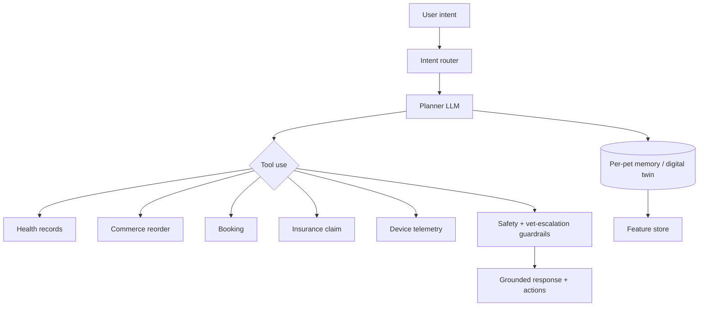

# 🐾 Pet OS — The Billion-Dollar Platform Review & Expansion Blueprint

> A founder/CEO/CTO/CPO/investor-grade teardown of the Pet Commerce Ecosystem and
> its expansion into a global **Pet Operating System**. This is written to challenge
> assumptions, expose gaps, and define the path to a 100M+ user, unicorn-scale platform.

**Thesis:** Pet platforms today are *vertical apps* (commerce OR vet OR tracking). The
winner will be the **operating system for pet life** — the identity, data, and transaction
layer that every pet, parent, vet, brand, and device plugs into. Own the *pet graph* and
you own the category.

---

## 0. Brutal honest review of the current build

| Area | Current state | The hard truth |
|------|---------------|----------------|
| Commerce | Catalog → cart → checkout | Transactional, not habitual. No replenishment AI, no auto-reorder, no basket intelligence. Margin-thin without private label. |
| Healthcare | Records + teleconsult UI | A filing cabinet, not a care engine. No continuity of care, no outcomes, no vet-side tooling. |
| AI | Canned chat | A demo, not a moat. No data flywheel, no personalization, no proactive intelligence. |
| Community | Feed + likes | A feature, not a network. No creators, no UGC monetization, no graph value. |
| IoT | Product listing | Devices sold, not *integrated*. No telemetry, no digital twin, no recurring data value. |
| Monetization | Marketplace margin | Single revenue stream = fragile. No recurring, no float, no platform take-rate. |
| Data | Fixtures | No data lake, no identity graph, no flywheel. **This is the real missing product.** |
| Defensibility | None yet | Everything here is copyable in 90 days. Moats must come from data + network + hardware + regulation. |

**Founder reframing:** You are not building a pet app. You are building the **Pet Identity
Graph + Transaction Layer + Care Network**. Apps are UI; the platform is the asset.

---

## 1. Architecture: from app to Pet Operating System

```mermaid
graph TB
  subgraph Clients
    M[Mobile apps]
    W[Web + PWA]
    VET[Vet/Groomer/Boarding SaaS]
    ENT[Enterprise/Brand portals]
    DEV[Devices / Wearables / Robots]
  end
  subgraph Platform["Pet OS Platform"]
    GQL[GraphQL BFF + API Gateway]
    IDQ[(Pet Identity Graph)]
    EB[[Event Bus / Kafka]]
    FS[Feature Store]
    AIORCH[AI Orchestration / Agent Runtime]
    WALLET[Payments / Wallet / Ledger]
  end
  subgraph Domains["Event-driven microservices"]
    C[Commerce] H[Health] S[Services] CO[Community]
    F[Fintech] INS[Insurance] IOT[IoT/Telemetry] SUB[Subscriptions]
    DEL[Hyperlocal Delivery] ADO[Adoption] EMG[Emergency] CRE[Creator]
  end
  subgraph Data
    LAKE[(Data Lakehouse)]
    VEC[(Vector DB)]
    TS[(Time-series)]
    ML[ML Platform / Feature pipelines]
  end
  Clients --> GQL --> Domains
  Domains <--> EB
  EB --> LAKE --> ML --> FS --> AIORCH
  IOT --> TS --> LAKE
  AIORCH --> Domains
  IDQ --- Domains
```

**Key architectural bets:**
- **Pet Identity Graph** as the core primitive: every pet has a portable ID, health passport,
  preferences, device graph, social graph, and transaction history. This is the moat.
- **Event-driven everything** (Kafka/Pulsar): `OrderPlaced`, `VaccineDue`, `GeofenceBreached`,
  `WeightLogged`, `SymptomReported` → fan out to AI, notifications, insurance, analytics.
- **Lakehouse + Feature Store** feeding a shared ML platform → every team gets personalization
  for free. Data flywheel compounds with each pet.
- **Agent runtime** (not just chat): planner + tools + memory, acting across domains.

---

## 2. Missing features (ship-now gaps)

**Commerce**
- Auto-replenishment ("Bruno runs out of food in 6 days — reorder?") with smart cadence prediction.
- Private-label + exclusive brands (margin engine; 40–60% vs 8–15% reseller).
- Subscribe-and-save tiers, bundles, "complete the routine" basket AI, 1-click reorder.
- Price-drop alerts, back-in-stock, dynamic pricing, surge-aware promos.
- UGC reviews with photos/video, verified-purchase, Q&A, size/breed fit guidance.
- Live shopping / shoppable reels, influencer storefronts, group-buy.

**Healthcare**
- Longitudinal health timeline + outcomes, not just documents.
- e-Prescriptions → integrated pharmacy fulfillment (high-margin, recurring).
- Lab integrations, diagnostic imaging upload + AI triage, second-opinion marketplace.
- Vet-side EMR/PMS SaaS (own the supply side), referral + continuity of care.
- Chronic condition programs (diabetes, kidney, obesity) = recurring, outcome-based.
- Vaccination/compliance passport accepted by boarding, travel, airlines.

**Services**
- Real-time dispatch (Uber-style) for walkers/groomers/pet-taxi with live tracking.
- Instant booking + guarantees, background-checked providers, insurance-backed trust.
- Dynamic pricing, provider ratings → tiers, re-book favorites, recurring service plans.

**Community**
- Creator economy: pet influencers, monetized content, affiliate storefronts, tipping.
- Breed/health/local groups, events/meetups, expert AMAs, challenges.
- Short-form video (reels), stories, DMs, following graph → network effects.

**IoT / Devices**
- Telemetry ingestion + digital twin, not just device sales.
- Smart feeder → auto-reorder trigger. GPS → geofence + lost-pet network.
- Health wearables (activity, HR, sleep, scratching) → early-warning AI → vet funnel.

**Platform**
- Universal search + discovery, deep links, referral + invite system, notification center,
  trust & safety, content moderation, dispute resolution, KYC for providers.

---

## 3. Future features (12–36 month horizon)

- **Digital Twin for Pets:** continuously-updated model (weight, activity, diet, genetics,
  conditions) powering predictions, simulations ("what if we switch food?"), and prevention.
- **Predictive health:** anomaly detection from wearables → "Mia's activity dropped 30%,
  possible early illness — book a consult." Prevention > cure = outcomes = insurance savings.
- **Agentic AI care copilot:** plans and *executes* — books vet, reorders meds, schedules
  grooming, files insurance claims, negotiates refills.
- **Genomics + nutrition:** DNA kit → breed/health risk → personalized diet + supplements (recurring).
- **AR/Metaverse:** AR apparel try-on, AR training coach, virtual pet memorials, pet avatars.
- **Robotics/Smart home:** integration with robot feeders, litter robots, pet doors, cameras;
  Alexa/Google/Matter/HomeKit; "pet mode" automations.
- **Pet travel OS:** airline/hotel compliance, pet passports, relocation, boarding marketplace.
- **Afterlife & legacy:** memorials, estate/trust for pets, grief support (high emotional LTV).

---

## 4. Revenue architecture (stack the streams)

```mermaid
graph LR
  subgraph Transactional
    A[Marketplace margin] B[Private label 40-60%]
    C[Pharmacy Rx] D[Service commissions]
  end
  subgraph Recurring
    E[Pet Prime tiers] F[Subscriptions food/meds]
    G[Insurance premiums/commission] H[Vet SaaS seats]
    I[Chronic care programs] J[Device + data subscriptions]
  end
  subgraph Platform
    K[Ads / sponsored listings] L[Retail media network]
    M[Lead-gen to vets/brands] N[Payments take-rate + float]
    O[Lending / BNPL] P[Data/insights to brands]
  end
  subgraph AI
    Q[Premium AI copilot] R[AI vet triage per-use]
    S[AI nutrition/genomics] T[AI-as-a-service to partners]
  end
```

**Hidden/underrated revenue:**
- **Retail Media Network** — once you have demand data, brands pay to reach pet parents
  (Amazon/Chewy's highest-margin business). Potentially the biggest line item at scale.
- **Payments float + wallet + BNPL** — hold balances, earn on float, lend against subscriptions.
- **Insurance** — originate + underwrite (with partner) using your health data = adverse-selection
  advantage no one else has. Wellness plans drive retention + claims reduction.
- **Vertical SaaS** — vet/groomer/boarding PMS + payments + inventory. Own supply, take a cut
  of every transaction forever (Toast/ServiceTitan for pet care).
- **Data products** — anonymized category/health trends to brands, CPG, pharma (privacy-safe).
- **Enterprise** — corporate pet benefits, apartment/HOA pet management, breeder/shelter tools.

**Target revenue mix at scale:** 35% recurring, 25% retail media/ads, 20% marketplace,
15% fintech/insurance, 5% AI/data. Durable, high-margin, compounding.

---

## 5. AI strategy & monetization

**AI Copilot architecture**


**Agentic workflows (AI that acts, with human-in-loop for medical):**
- Auto-reorder agent, appointment-booking agent, claims-filing agent, nutrition-tuning agent,
  medication-adherence agent, lost-pet-alert agent.

**AI monetization:**
- Premium copilot tier, per-use symptom triage, genomics/nutrition plans, AI photo health scans
  (skin, dental, gait, weight-from-photo), AI training coach, AI grief companion.
- **AI-as-a-service:** sell your triage/nutrition models to insurers, vets, and brands.

**Moat:** proprietary labeled outcome data (symptom → diagnosis → treatment → result) that only
a closed-loop care+commerce+insurance platform can accumulate. Data flywheel = compounding moat.

---

## 6. Growth loops & network effects

**Viral / growth loops**
1. **Lost-pet network** — QR/GPS tags; found pet scans tag → installs app → new user. Civic virality.
2. **Pet profiles as social objects** — shareable pet pages, breed-off, health-score flex.
3. **Referral with two-sided reward** — free consult / delivery credit both sides.
4. **Creator loop** — influencers bring audiences → storefronts → more creators.
5. **Adoption loop** — shelters list pets → adopters onboard → lifetime pet parents.
6. **Vet/groomer SaaS loop** — provider invites clients → clients invite pets → more providers.
7. **UGC/review loop** — content improves SEO + discovery + trust → organic acquisition.
8. **Challenge/gamification loop** — "30-day fitness challenge" shared socially.

**Network effects (stack them):**
- **Data** (every pet improves predictions) · **Social** (graph of parents + creators) ·
  **Marketplace** (more supply ↔ demand) · **Platform** (devices + vets + brands) ·
  **Local density** (hyperlocal delivery + services get better per neighborhood).

---

## 7. Retention, engagement & gamification

- **Health Score** as the north-star engagement metric (like a credit score for pets) — streaks,
  trends, nudges, shareable.
- **Daily loops:** feeding log, activity rings, meds check-off, photo-a-day, tip of the day.
- **Streaks, badges, levels, Paw Points**, reward store, surprise-and-delight, birthday moments.
- **Proactive reminders** (vaccines, meds, reorder) = utility that pulls users back.
- **Pet Prime** as the retention flywheel: free delivery + vet + insurance perks → low churn.
- **Lifecycle engine:** puppy/kitten onboarding → adult → senior care programs (stage-based LTV).
- **Emotional moments:** adoption anniversary, memory reels, memorials (deep retention).

---

## 8. Marketplace & supply-side strategy

- **Own supply = defensibility.** Vet/groomer/boarding SaaS makes you the system of record.
- Verified/background-checked providers, trust & safety, insurance-backed guarantees, escrow.
- Dynamic pricing, provider tiers, instant booking, SLAs, dispute resolution, reviews.
- Dark stores / micro-fulfillment for 10–30 min hyperlocal delivery in dense cities.
- Fulfillment: 1P (private label, fast) + 3P (long tail) hybrid; FBA-style for pet brands.

---

## 9. Scalability to 100M+ users

- **Multi-region, cell-based architecture**; active-active; data residency per country.
- **Event-driven microservices**, async everything, idempotent consumers, sagas for orders/payments.
- **Polyglot persistence:** Postgres (txn), Mongo (feed), Redis (cache/sessions), TimescaleDB
  (telemetry), object store (media), vector DB (AI), lakehouse (analytics).
- **CQRS + read replicas**, materialized views, CDN + edge, GraphQL BFF with persisted queries.
- **Observability:** OpenTelemetry, SLOs, chaos testing, feature flags, progressive delivery.
- **Cost discipline:** tiered storage, spot compute for ML, caching, rate limiting, autoscaling.
- **Data lakehouse + streaming** (Kafka → Flink/Spark → Iceberg/Delta) → real-time + batch ML.

---

## 10. International & multi-country architecture

- **Localization core:** currency, tax/GST/VAT, language, payment methods, regulatory per market.
- **Pluggable compliance layer** (vet licensing, pharmacy, data privacy: GDPR/DPDP/CCPA).
- **Market playbook:** India first (density, cost, talent) → SEA/MENA → then regulated Western
  markets (US/EU) where insurance + Rx margins are richest.
- **Config-driven storefronts**, country feature flags, local supply onboarding, local creators.
- Single Pet Identity Graph, regional data planes, global brand + local operations.

---

## 11. Enterprise & B2B SaaS opportunities

- **Vet/Clinic PMS** (EMR, scheduling, payments, inventory, telehealth) — recurring seats + take-rate.
- **Groomer/Boarding/Daycare** management suite.
- **Brand/Retail Media** self-serve ad platform + insights dashboard.
- **Corporate pet benefits** (employee perk), **insurance partner portal**, **shelter/breeder CRM**.
- **Apartment/HOA/real-estate** pet compliance + screening. **Airline/hotel** pet compliance API.

---

## 12. Defensibility & moats (the investor question)

1. **Pet Identity Graph + health data** (proprietary, compounding, switching-cost).
2. **Closed-loop outcomes data** (care → commerce → insurance) no single-vertical player has.
3. **Supply ownership** via vet/groomer SaaS (system of record).
4. **Hardware + telemetry** (devices create recurring data + lock-in).
5. **Network effects** (social + marketplace + local density).
6. **Regulatory/insurance** positioning (hard to replicate, licensing moat).
7. **Brand + community** (emotional category; trust compounds).

---

## 13. Sequenced roadmap (what to build, in order)

**Now → 6 mo (Habit + flywheel foundations)**
Auto-replenishment · Subscribe & save · Payments/wallet · Health timeline + reminders ·
e-Prescriptions/pharmacy · Real-time service dispatch · Referral + lost-pet QR · Data lake v1 +
event bus · Personalized home/recommendations · Reviews/UGC.

**6–18 mo (Moats + monetization)**
Private label · Insurance (wellness plans) · Vet SaaS (EMR) MVP · Retail media v1 · Wearables +
telemetry + digital twin v1 · Creator economy · Agentic AI copilot · Chronic care programs ·
Hyperlocal micro-fulfillment.

**18–36 mo (Platform + global)**
Full digital twin + predictive health · Genomics · Insurance underwriting · International (2–3
markets) · Enterprise SaaS suite · AI-as-a-service · Robotics/smart-home · AR/metaverse readiness.

---

## 14. North-star & KPI tree

- **North star:** *Pets actively managed on the platform* (profiles with ≥1 weekly action).
- **Flywheel KPIs:** D1/D30 retention, reorder rate, subscription attach, health-score engagement,
  provider GMV, insurance attach, AI actions/user, retail media revenue, pet-graph size.
- **Financial:** recurring-revenue %, contribution margin, LTV/CAC, net revenue retention, float.

---

### The one-line pitch
> **"We're building the operating system for pet life — the identity, health, and commerce layer
> that every pet, parent, vet, brand, and device connects to. Own the pet graph, own the category."**
